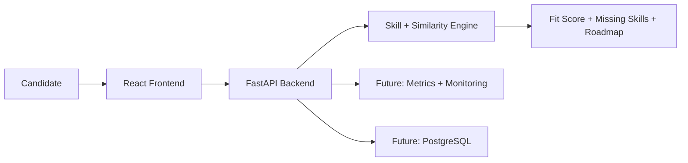

# HireSense AI

Open-source resume intelligence and job matching platform for students, freshers, and early-career professionals.

HireSense AI helps a candidate compare a resume against a job description, identify missing skills, estimate fit, and generate a practical upskilling plan. The project is designed as a production-style AI engineering portfolio project: API-first, testable, containerized, documented, and ready to grow into an MLOps system.

## Why This Project Exists

Most AI portfolio projects stop at notebooks. HireSense AI is built to show real engineering maturity:

- A backend API with clean business logic.
- A modern frontend workflow.
- Automated tests and CI.
- Docker-based local setup.
- Open-source documentation and contribution flow.
- Clear roadmap toward NLP, LLMs, MLOps, cloud deployment, and monitoring.

## Current Features

- Resume text and job description matching.
- Resume PDF upload with text extraction.
- Skill extraction from common AI/data/devops keywords.
- Hybrid match scoring with skill overlap and semantic similarity.
- Separate skill, semantic, and overall fit scores.
- Missing skill recommendations.
- Learning roadmap generation.
- FastAPI backend endpoint.
- React frontend starter.
- Unit tests for matching logic.

## Tech Stack

- **Backend:** Python, FastAPI, Pydantic
- **PDF Processing:** pypdf
- **NLP Scoring:** lexical semantic similarity baseline, designed for future sentence-transformer upgrade
- **Frontend:** React, Vite, TypeScript
- **Testing:** unittest, pytest-compatible structure
- **DevOps:** Docker, Docker Compose, GitHub Actions
- **Planned MLOps:** MLflow, Airflow/Prefect, monitoring, model registry

## Architecture



## Quick Start

### Backend

```bash
cd backend
python -m venv .venv
.venv\Scripts\activate
pip install -r requirements.txt
uvicorn app.main:app --reload
```

API docs will be available at:

```text
http://localhost:8000/docs
```

### Frontend

```bash
cd frontend
npm install
npm run dev
```

Frontend will be available at:

```text
http://localhost:5173
```

### Docker Compose

```bash
docker compose up --build
```

## API Example

```bash
curl -X POST http://localhost:8000/api/v1/analyze \
  -H "Content-Type: application/json" \
  -d "{\"resume_text\":\"Python SQL FastAPI machine learning Docker\",\"job_description\":\"We need Python, SQL, Docker, Kubernetes, MLflow and AWS.\"}"
```

Example response:

```json
{
  "score": 52,
  "skill_score": 50,
  "semantic_score": 57,
  "scoring_method": "hybrid_skill_overlap_70_semantic_30",
  "matched_skills": ["docker", "python", "sql"],
  "missing_skills": ["aws", "kubernetes", "mlflow"]
}
```

### Analyze a Resume PDF

```bash
curl -X POST http://localhost:8000/api/v1/analyze-resume-file \
  -F "resume_file=@resume.pdf" \
  -F "job_description=We need Python, SQL, Docker, Kubernetes, MLflow and AWS."
```

## Open Source Hosting Plan

This project is intended to be hosted publicly on:

- **GitHub:** source code, issues, project board, releases.
- **GitHub Pages or Vercel:** frontend demo.
- **Render, Fly.io, Railway, or Hugging Face Spaces:** backend/API demo.
- **Docker Hub or GitHub Container Registry:** container images.
- **Medium/Hashnode/Dev.to:** case study and learning notes.

## Roadmap

See [docs/ROADMAP.md](docs/ROADMAP.md).

## Contributing

Contributions, issues, feature ideas, and documentation improvements are welcome. See [CONTRIBUTING.md](CONTRIBUTING.md).

## License

MIT License. See [LICENSE](LICENSE).
